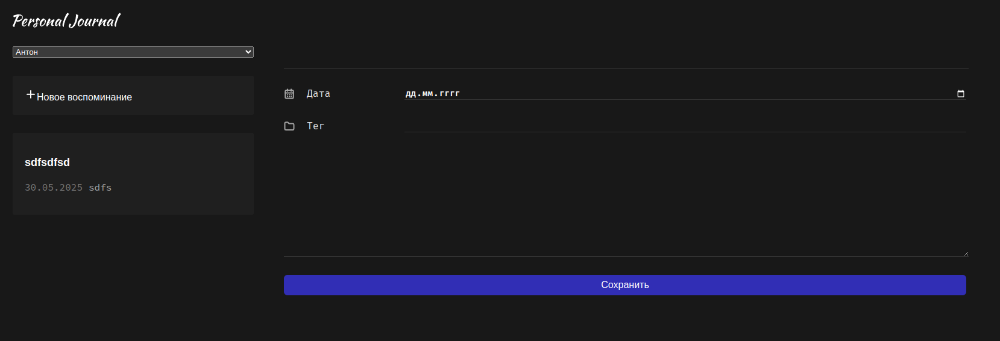

# Журнал на React

Этот репозиторий содержит учебное приложение. Проект представляет собой простое приложение для ведения заметок, созданное на базе Vite и React.



## Структура проекта

Основной код расположен в каталоге [`react-app`](react-app). В нём находятся исходники React-компонентов, стили и конфигурационные файлы.

## Быстрый старт

1. Перейдите в каталог `react-app`:
   ```bash
   cd react-app
   ```
2. Установите зависимости:
   ```bash
   npm install
   ```
3. Запустите режим разработки:
   ```bash
   npm run dev
   ```
4. Для проверки кода ESLint выполните:
   ```bash
   npm run lint
   ```
5. Сборка проекта:
   ```bash
   npm run build
   ```
6. Просмотр собранной версии:
   ```bash
   npm run preview
   ```

## Возможности

- Хранение данных в `localStorage` через собственный хук `useLocalStorage`.
- Выбор активного пользователя с помощью контекста React.
- Добавление и редактирование заметок через форму.
- Просмотр списка заметок с сортировкой по дате.

Проект создан в учебных целях и может служить отправной точкой для более крупных приложений на React.
